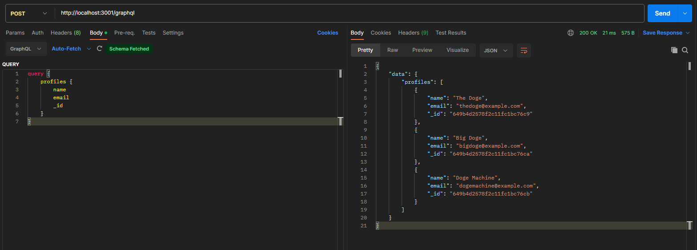

# MERN Backend Example

## Important Disclaimer!!
Be sure to change database connection string in ```config/connection.js``` after forking your own version.`

## Table of Contents
- [Description](#description)
- [Installation](#installation)
- [Usage](#usage)
- [Screenshot](#screenshot)
- [License](#license)

## Description
Boilerplate modular MERN backend. Set up to create, and authenticate users into a database. Nothing more. Add more functionality as needed.

## Installation
Installations required: <br />
npm i

## Usage
Be sure to run ```npm run seed``` to seed that database. Once the database is seeded run the program using ```npm start``` <br />
You can query graphql in postman at ```http://localhost:3001/graphql``` and an example query should look like:
```
query {
    profiles {
        name
        email
        _id
    }
}
```

## Link
This is boilerplate to use as a jumping off point, and thus does not have a live deployment.

## Screenshot
Here is a screenshot of the application running. <br /> 

## Contact me
Here is my [GitHub Profile](https://github.com/reidmadock) <br />
- - -
## License
Distributed under the [None]() <br />
